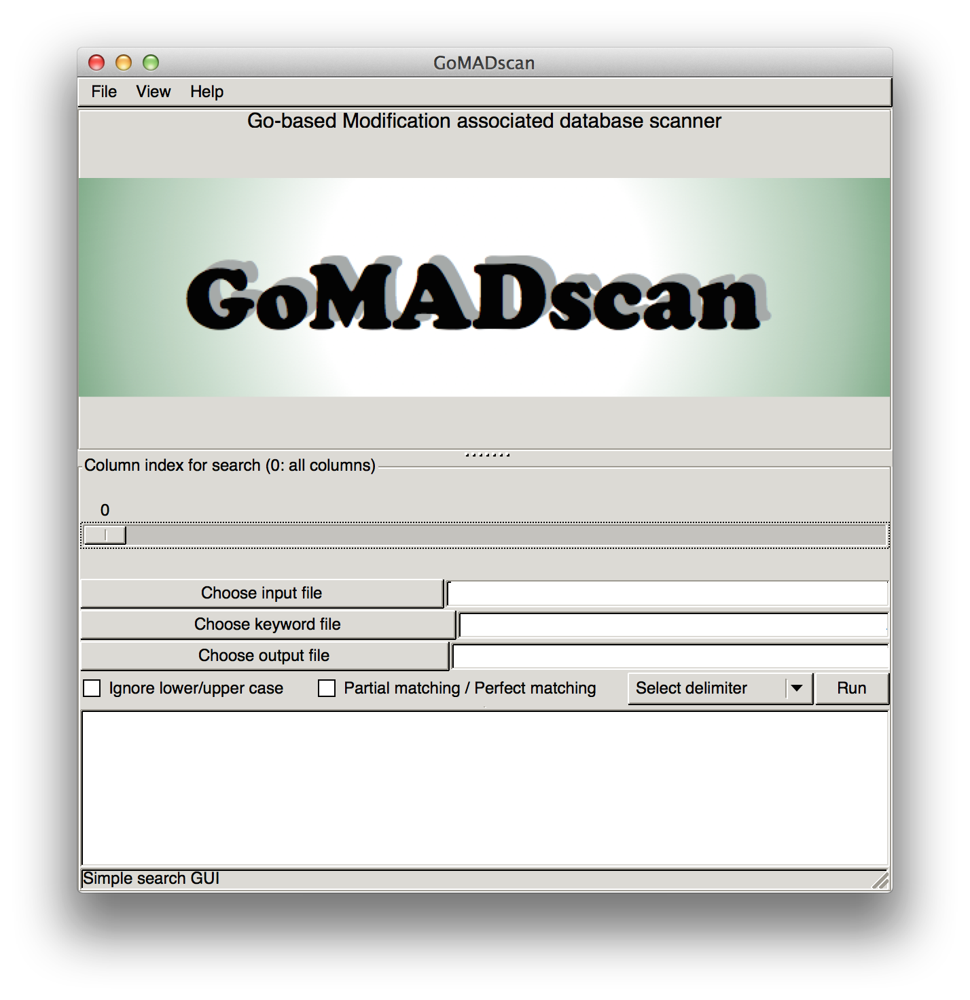

# MADscan


[](https://drone.io/github.com/carushi/MADscan/latest)

<font size=5>Modification Associated Database SCANner based on GUI</font>

* MADscan is developed to achieve **user-friendly keyword searching**
* MADscan can handle character separated values (CSV) files such as the dataset available in [PhosphoSitePlus](http://www.phosphosite.org/homeAction.action).


## Downloads

If you already have an environment to use go lang and gtk+, type a below command in your terminal.

```
go get github.com/carushi/MADscan
```

For a more detailed instruction, check our [wikipage](https://github.com/carushi/MADscan/wiki).




## Requirement

* go language
	* Reference: [golang.org](https://golang.org)

* go-gtk (including GTK-Development-Packages)
	* Reference: [go-gtk repository](https://github.com/mattn/go-gtk)
	* I refered "demo" of go-gtk for implementation.


	
## ToDo
* header skipping or including


